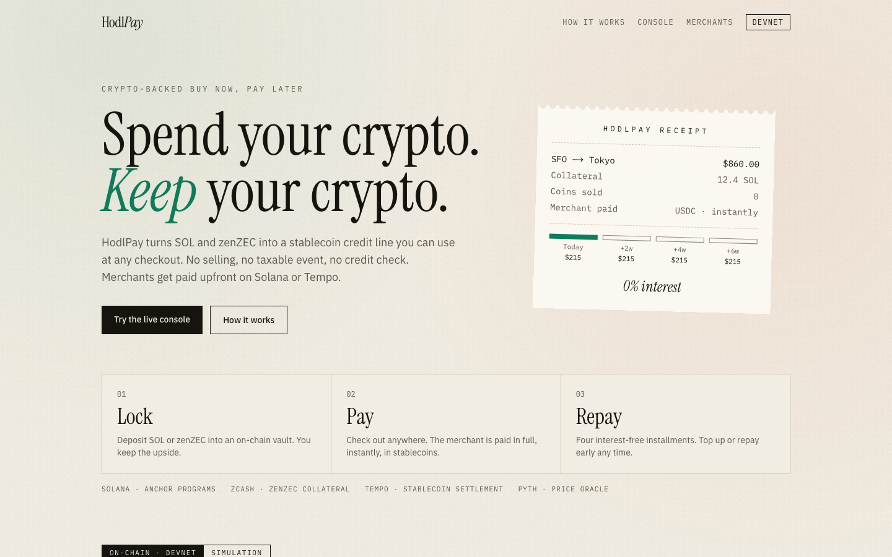
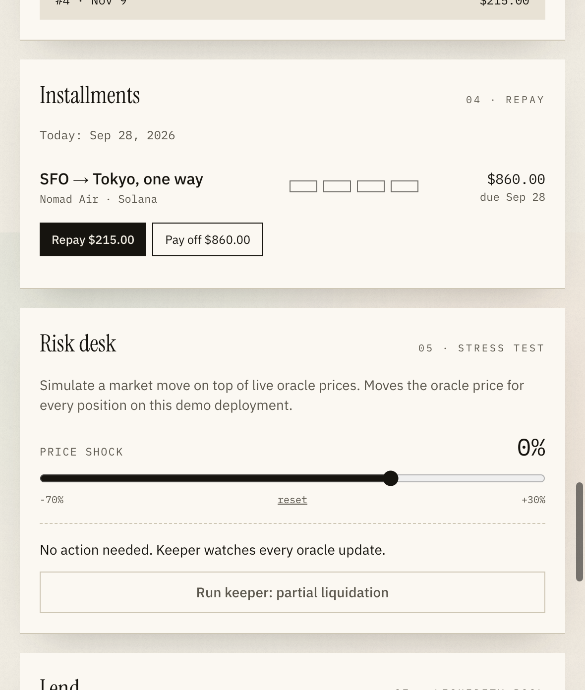
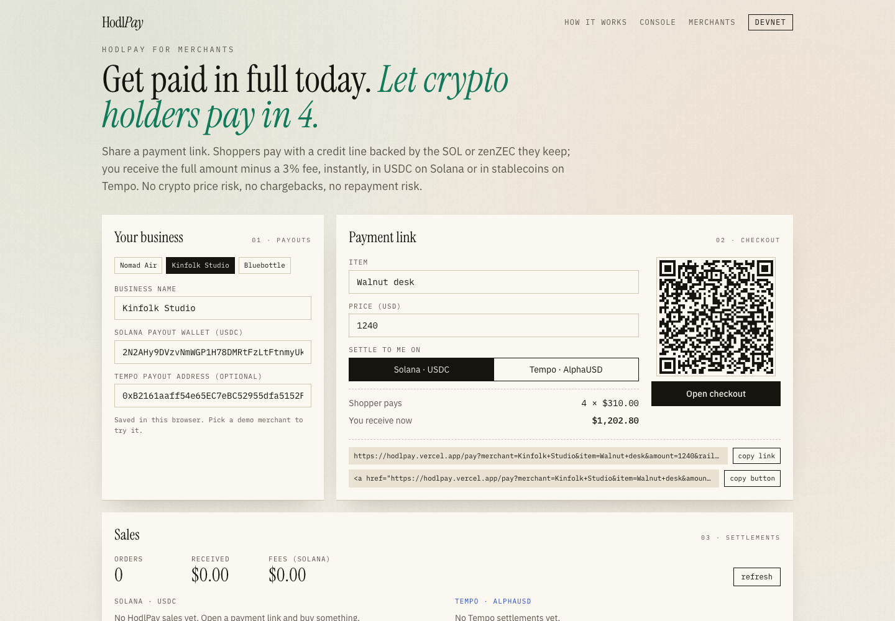

# HodlPay

[](https://github.com/gaoyunlong6768/hodlpay/actions/workflows/ci.yml)

**Spend your crypto. Keep your crypto.**

HodlPay is crypto-backed Buy Now, Pay Later. Holders lock SOL or zenZEC (Zcash on Solana) as collateral and get a stablecoin credit line they can use at any checkout. The merchant is paid upfront in USDC on Solana or in stablecoins on Tempo; the user repays in 4 interest-free installments. No selling (so no capital-gains sale in most jurisdictions), no credit check and no personal data: the collateral is the credit check, and every installment paid on time raises the credit limit on-chain. It also works at shops that have never heard of HodlPay: scan the merchant's existing Solana Pay QR and pay it in 4, while their point of sale sees a normal USDC payment.

Built for the Colosseum Crypto World's Fair (Solana, Tempo and Zcash tracks).

## Try it

**Live on Solana devnet: [hodlpay.vercel.app](https://hodlpay.vercel.app)**

1. Open the console and click **Use demo wallet**: a real devnet wallet created in your browser, no extension and no signing popups (its key stays in localStorage, so test funds only). Or click **Connect wallet** to use Phantom, Solflare or Backpack switched to devnet.
2. Click **Get test funds**: 2,000 test USDC, 3 test zenZEC and a little SOL for fees.
3. Lock zenZEC, buy the $860 flight and pick the settlement rail (USDC on Solana or stablecoins on Tempo).
4. Repay an installment (paid in the week before its due date, it moves the credit ladder in the Credit line card; earlier, it is accepted and the row shows when it would count), then drag the Risk desk slider to -60% to trigger a margin alert and a keeper liquidation.

Merchants can generate a payment link and QR code at [hodlpay.vercel.app/merchant](https://hodlpay.vercel.app/merchant). To try Solana Pay, open **Solana Pay point of sale** there, press **Show Solana Pay code**, then scan it at [hodlpay.vercel.app/scan](https://hodlpay.vercel.app/scan) on your phone (or press **Pay it with HodlPay here**); the point of sale confirms the payment with `@solana/pay`'s own `validateTransfer`. Every action is a real devnet transaction linked to the explorer.

| | |
| --- | --- |
| Program (devnet) | [`5WWDSNYRjmU3Jp7DywyYgDYtYiBBZ3e8JmcBgS2HxihH`](https://explorer.solana.com/address/5WWDSNYRjmU3Jp7DywyYgDYtYiBBZ3e8JmcBgS2HxihH?cluster=devnet) |
| Test USDC mint | [`52WhUKNE1iz9Ddgc1BoqUfADuFQAxViW9m6Hnao3NdBg`](https://explorer.solana.com/address/52WhUKNE1iz9Ddgc1BoqUfADuFQAxViW9m6Hnao3NdBg?cluster=devnet) |
| Test zenZEC mint | [`6t8pBbX7hMtXmFjfJDjMiiGrPqYXbK7YzK1SzSqkcb2J`](https://explorer.solana.com/address/6t8pBbX7hMtXmFjfJDjMiiGrPqYXbK7YzK1SzSqkcb2J?cluster=devnet) |



| Checkout: merchant paid upfront, 4 installments scheduled | Merchant portal: payment link, QR code, sales |
| --- | --- |
|  |  |

## How it works

1. **Lock**: deposit SOL or zenZEC into an on-chain vault. Each asset has its own risk tier.
2. **Pay**: at checkout the protocol pays the merchant from the liquidity pool, minus a 1.5% merchant fee. The merchant chooses the rail: USDC on Solana, or a TIP-20 stablecoin on Tempo.
3. **Repay**: 4 installments, 14 days apart, 0% interest for the user. The first is paid inside the `checkout` instruction itself, so the credit limit only has to cover the other three (if the wallet holds too little USDC, the first stays due that day and the full price counts against the limit). Paying more than 3 days after a due date adds a 1% late fee on that installment.
4. **Missed payment**: an installment still unpaid 3 days after its due date is collected from the borrower's collateral. `collect_overdue` is permissionless: the collector pays the installment plus the 1% late fee into the pool and receives collateral worth that amount plus the 5% bonus. The loan moves on to its next installment and the rest of the position is untouched, so a missed payment costs the borrower about 6% of one installment instead of a liquidation. The keeper runs it every hour.
5. **Protect**: the keeper posts oracle prices and emits a margin alert first; only past the liquidation line can a liquidator repay part of the debt (max 50% per call) and take collateral at a 5% bonus. Repaid amounts are credited to the user's upcoming installments.

| Asset  | Max LTV | Margin alert | Liquidation |
| ------ | ------- | ------------ | ----------- |
| SOL    | 50%     | 65%          | 75%         |
| zenZEC | 40%     | 55%          | 65%         |

Collateral needed for a $1,000 purchase, with the first $250 paid at checkout (only the $750 still owed counts against the limit):

| Collateral | No history | Credit level 4 |
| ---------- | ---------- | -------------- |
| SOL        | $1,500     | $1,250         |
| zenZEC     | $1,875     | $1,500         |

Financing the full $1,000 against the limit, as most collateralized credit does, would need $2,000 of SOL. The risk is the same: the position never owes more than its collateral covers at max LTV.

### On-time credit ladder

The collateral is the credit check; repayment history is the credit score. Each wallet has a `CreditProfile` PDA that `repay` updates:

- Every $250 the borrower repays on time in USDC adds 2.5 points of max LTV, up to +10 points (level 4). On time means in the 7 days before the due date (`CREDIT_WINDOW`) or within the 3-day grace period after it; the first installment, paid at checkout, does not count.
- Prepaying earlier is always allowed but builds no credit. Otherwise a wallet could check out to itself and repay every installment in the same minute, buying level 4 for the 1.5% fee; with the window, each level takes real repayment weeks.
- The boost stops 5 points below the margin alert line: SOL goes from 50% to at most 60%, zenZEC from 40% to at most 50%.
- A late payment, an overdue collection or a liquidation resets progress to level 0.
- Levels raise the limit for new purchases and withdrawals only. Margin alerts, health checks and liquidation always use the base tiers, so a higher level never lets a position get closer to liquidation than it could before.

So a loyal zenZEC holder needs 2 ZEC instead of 2.5 ZEC to buy the same thing, while the protocol still never lends without collateral. The history lives on-chain, keyed to the wallet, with no name or ID attached.

### Credit without surveillance

Unsecured pay-in-4 has to know who you are: it collects a name, date of birth, phone number and often bank data, runs a credit check, and increasingly reports each plan to credit bureaus. Collateral makes all of that unnecessary, so HodlPay never asks:

| | Unsecured BNPL | HodlPay |
| --- | --- | --- |
| To get approved | Identity, phone, credit check | A wallet with collateral |
| Who learns about the purchase | The lender, and often a credit bureau | Nobody beyond the chain: the program sees a wallet, never a person |
| What the merchant learns about you | Name and contact data from the lender | A USDC payment from a wallet (on the Solana Pay path, not even that it was financed) |
| Credit history | A bureau file tied to your legal identity | `CreditProfile` tied to a pseudonymous wallet; start a new wallet and you start fresh |
| If you miss a payment | Collections and a bureau record | That installment is taken from your collateral; nothing leaves the chain |

For ZEC holders this completes the picture: Zcash keeps what you hold private, and HodlPay lets you spend it without handing over who you are. The honest limit is that Solana is transparent: a wallet's collateral, loans and repayments are public, so the privacy is pseudonymity, not secrecy. Keep a dedicated wallet for HodlPay and fund it from shielded ZEC through Zenrock so it isn't linked to the rest of your history. Next steps: prove a credit level to other protocols without revealing the wallet (a zero-knowledge proof over `CreditProfile`), and shielded repayments from Zcash.

### Who earns what

| Party     | Pays                          | Gets                                              |
| --------- | ----------------------------- | ------------------------------------------------- |
| Shopper   | 0% interest, late fee if late | Spending power without selling                    |
| Merchant  | 1.5% fee                      | Full amount upfront in stablecoins, no price risk |
| LP        | USDC into the pool            | 70% of merchant fees + late fees, via LP share price |
| Treasury  | Nothing                       | 20% of fees, claimable by the admin to the treasury wallet |
| Reserve   | Nothing                       | 10% of fees as first-loss capital: covers bad debt before LPs lose anything |

The split is written into the program (`Protocol` account, `set_protocol` changes it; treasury plus reserve is capped at 50%). It applies only to fees paid in cash; fees on installments settled from liquidation credit stay with LPs. Anyone can add first-loss capital with `fund_reserve`; it can never be withdrawn, only spent on write-offs. On devnet the reserve was seeded with 5,000 test USDC and the console's Lend card shows it live.

The pool is value-accruing: `pool value = idle USDC in vault − treasury and reserve balances + outstanding debt − unearned merchant fees`. Treasury and reserve funds sit in the same vault but are not lent out and cannot be withdrawn by LPs. The merchant fee on a loan is earned installment by installment, so an LP cannot capture a fee by depositing right before a checkout and withdrawing right after. LP shares are an SPL mint owned by the program; depositing mints shares at the current share price, withdrawing burns them and is limited to idle liquidity.

### Merchant side

- **Payment links** (`/pay?merchant=…&item=…&amount=…&rail=solana|tempo&to=…`): a hosted checkout any merchant can send or embed. The shopper connects a wallet, locks just enough SOL or zenZEC if their credit is short, and pays in 4. The merchant is paid in the same transaction.
- **Any Solana Pay merchant** (`/scan`): see [Pay any Solana Pay QR](#pay-any-solana-pay-qr). No integration and no fee for the merchant.
- **Merchant portal** (`/merchant`): set payout addresses, generate a payment link, QR code and embeddable "Pay in 4 with HodlPay" button, and see every sale: Solana loans read from the program (filtered by merchant), Tempo payouts read from the settlement contract's `Settled` events.

### Pay any Solana Pay QR

A shopper scans a merchant's standard Solana Pay transfer request (`solana:<wallet>?amount=…&spl-token=<USDC>&reference=…`) with the camera, a screenshot or a pasted link. HodlPay turns it into one transaction:

1. `checkout` finances the plan to the shopper's own USDC account.
2. `repay` takes the first installment, if the wallet can cover it.
3. The memo from the code, if there is one.
4. A plain SPL `transferChecked` of exactly the requested amount to the merchant, with the code's reference keys attached.

That is the shape Solana Pay's `validateTransfer` checks: the transfer is the last instruction, the memo is right before it, and the reference keys match. So the merchant's existing point of sale finds the payment by its reference and accepts it without knowing HodlPay exists; the merchant gets 100% of the price. Because this merchant never agreed to a fee, the shopper's plan carries the 1.5% instead (a $42.50 code becomes a $43.15 plan, 4 × $10.79). Partner merchants who take HodlPay links pay it instead. The program is unchanged: this is the same `checkout`, with the shopper as the payee. Only transfer requests in USDC are supported; transaction requests (`solana:https://…`), where the merchant builds the transaction, are on the roadmap.

The merchant portal includes a minimal Solana Pay point of sale with no HodlPay code in its verification path (`findReference` + `validateTransfer` from `@solana/pay`) to show this end to end.

### Oracle

Every asset stores its Pyth feed id. `refresh_price` is permissionless: anyone can pass a Pyth `PriceUpdateV2` account (for example the sponsored feed accounts Pyth keeps fresh on devnet and mainnet), and the program checks the owner (Pyth receiver), full Wormhole verification, the feed id, the confidence interval (≤ 2% of price) and the age before accepting it. Older updates never overwrite newer prices. The keeper uses this path when a fresh sponsored feed exists and falls back to posting prices itself (`update_price`) otherwise, e.g. on localnet or during the demo stress test. The mainnet build (`cargo build-sbf --features mainnet`) rejects `update_price` with `KeeperPricesDisabled`, so there no key can set a price; CI builds that variant and the test `mainnet_build_prices_from_pyth_only` runs against it.

### How it compares

Spending against crypto collateral already exists. What is different here is who pays and how the debt is shaped: HodlPay is BNPL, not a loan. The merchant pays a fee in exchange for a sale and upfront settlement, so the shopper pays 0% interest on a fixed 4-installment schedule.

| | HodlPay | Yumi Finance | Buydl | ether.fi Cash (Borrow Mode) | Nexo Card (Credit Mode) | Klarna / Affirm |
| --- | --- | --- | --- | --- | --- | --- |
| Shopper cost | 0% interest, late fee only | 0% on pay-in-4 | Kamino borrow rate | Variable Aave rate from day one | Credit-line rate by loyalty tier | 0% on pay-in-4 |
| Who funds it | Merchant fee (1.5%) to an LP pool | Merchant fee (3%) | Shopper interest to Kamino lenders | Shopper interest to Aave lenders | Shopper interest to Nexo | Merchant fee |
| Repayment | 4 installments, 14 days apart | 4 installments | Open-ended loan | Open-ended, no schedule | Open-ended | 4 installments |
| Approval | Collateral: SOL, zenZEC (per-asset risk tiers) | Unsecured, credit underwriting | SOL collateral | Vault assets (ETH, BTC, stables…) | Custodial deposit | Unsecured, credit check |
| Missed payment | Collected from collateral after 3 days | Collections, default risk | Liquidation | Liquidation | Liquidation | Collections, default risk |
| Credit limit grows with | On-time repayments, on-chain (up to +10 pts LTV) | Underwriting data | Collateral only | Collateral only | Loyalty tier | Credit history |
| Merchant settlement | USDC on Solana or stablecoins on Tempo | Stablecoins on Solana | USDC on Solana | Visa rails | Visa rails | Fiat, days later |
| Custody | Non-custodial program | n/a | Non-custodial (Kamino) | Non-custodial (Safe) | Custodial | n/a |

- **Versus Yumi Finance** (on-chain pay-in-4, Cypherpunk DeFi track winner): Yumi underwrites first and hopes to be repaid, so it has to judge who is creditworthy and carry default losses. HodlPay lends safely first and then learns: every loan is backed by collateral, so approval needs no personal data and works for any holder anywhere, and a missed installment is collected from collateral instead of written off. With no default losses to price in, the merchant fee is half (1.5% instead of 3%), and on-time repayments lower the collateral a shopper needs over time. HodlPay also needs no merchant integration to start: any merchant that already takes Solana Pay can be paid in 4 today. The two approaches serve different people: Yumi reaches shoppers without crypto wealth, HodlPay reaches holders who don't want to sell it.
- **Versus crypto cards and borrow routers**: they are loans with the shopper paying interest for as long as the balance is open. HodlPay moves the cost to the merchant, which is how BNPL wins checkout share, and gives the shopper a fixed end date. The merchant also gets a sales channel: hosted payment links and a portal, not just a payment method.
- **Versus Klarna and Affirm**: same economics for the merchant, but no credit check, so it serves crypto holders anywhere, and the merchant is paid in stablecoins in seconds instead of fiat in days.
- **Chains and assets**: Tempo settlement for merchants who want payment-chain stablecoins, and zenZEC collateral so ZEC holders can pay at checkout, where today their only on-chain option on Solana is an interest-bearing loan (Kamino's ZEC market).

## Architecture

```
                    ┌────────────── Solana ──────────────┐
 Shopper wallet ──▶ │ hodlpay program (Anchor)           │
                    │  position PDA: collateral slots    │
                    │  loan PDA: 4-installment schedule  │
                    │  vault PDAs: SOL / zenZEC / USDC   │
                    │  LP mint PDA: pool shares          │
                    └──────┬───────────────┬─────────────┘
                           │ USDC          │ USDC + memo "hodlpay:tempo:<0x merchant>"
                           ▼               ▼
                     Solana merchant   Tempo bridge account
                                           │ 3 attesters each re-read the tx through their own RPC
                                           │ and sign the payout (EIP-712); any 2 suffice
                                           ▼
                    ┌────────────── Tempo ───────────────┐
                    │ HodlPaySettlement.sol              │
                    │  settle(ref, merchant, token, amt, │
                    │         2-of-3 signatures)         │
                    │  per-payout + 24h caps, pause      │
                    │  transferWithMemo(merchant, ref)   │
                    │  replay-protected per Solana sig   │
                    └────────────────────────────────────┘
                                           │
                     /audit re-derives every payout from its Solana checkout

 Keeper (app/scripts/keeper.ts, /api/keeper, hourly Vercel cron): Pyth → refresh_price (or update_price),
 collect overdue installments, margin alerts (Telegram), liquidate unhealthy positions.
```

### Repository

```
protocol/   Anchor program (Rust) + LiteSVM integration tests
tempo/      Solidity settlement contract for Tempo merchants
app/        Next.js console, API routes (faucet, keeper, Tempo relayer) and ops scripts
docs/       Go-to-market notes, pitch and demo video scripts
```

### Program instructions

| Group     | Instructions                                                   |
| --------- | -------------------------------------------------------------- |
| Admin     | `initialize`, `add_asset`, `update_price` (devnet build only), `set_keeper`, `set_merchant_fee`, `init_protocol`, `set_protocol` (fee split and beta caps), `claim_revenue` |
| Oracle    | `refresh_price` (permissionless, Pyth)                         |
| Liquidity | `deposit_liquidity`, `withdraw_liquidity`, `fund_reserve` (permissionless) |
| Position  | `open_position`, `deposit`, `withdraw`                         |
| Credit    | `checkout`, `repay`                                            |
| Risk      | `collect_overdue`, `liquidate`, `check_health` (all permissionless) |

Valuation, credit limits and liquidation thresholds are computed on-chain from the position's collateral slots and per-asset oracle prices. Stale prices (older than `max_price_age`) block new credit, withdrawals and liquidations.

### Tempo rail

When a merchant wants settlement on Tempo, checkout pays the Tempo bridge account on Solana and attaches a memo `hodlpay:tempo:<evm address>`, in the same transaction.

1. **Attest.** Each of three attesters independently reads the confirmed Solana transaction through its own RPC endpoint, accepts it only if it holds exactly one HodlPay `checkout` whose merchant account is the bridge, takes the amount from the on-chain loan (`merchant_received`) and the merchant from the memo, and signs that exact payout as EIP-712 typed data: `Settle(checkoutRef, merchant, token, amount)` with `checkoutRef = keccak256(solana signature)`.
2. **Settle.** Anyone can submit the payout with the signatures (`/api/tempo/settle` does it for the app). `HodlPaySettlement.settle` pays only with 2 valid, distinct attester signatures, at most once per checkout, up to 5,000 per payout and 50,000 per rolling 24 hours, and not while paused. It pays the merchant with `transferWithMemo`, using `checkoutRef` as the memo, so every Tempo payment points back to its Solana checkout.
3. **Audit.** [`/audit`](https://hodlpay.vercel.app/audit) trusts neither the relayer nor the attesters: for every `Settled` event it finds the Solana transaction to the bridge whose signature hashes to the payout's `checkoutRef`, re-reads amount and merchant, and flags anything that does not match.

Testnet deployment (Moderato, chain 42431): contract `0xb3920ba511f21ecc6b7780d56a510a6328683de6`, paying AlphaUSD. The first, single-relayer contract `0x0a5cdea68a5acd2d070ba9a2e39299356408c402` was drained into it; its payouts still appear in the portal and the audit. Seven of them paid for checkouts on a local test validator before the devnet launch, which is exactly what one relayer key could do and two independent attesters reading devnet will not.

Trust model: the relayer key only pays gas; it cannot move funds without 2 attester signatures. A forged payout needs 2 of the 3 attester keys and is still bounded by the per-payout and daily caps, and a guardian can pause the contract. Attesters can delay a payout but not redirect it. In this demo all three attester keys are operated by HodlPay (on separate RPC endpoints), so the 2-of-3 threshold guards against one compromised key or one lying RPC, not against the operator. Next: hand attester keys to independent operators (a merchant acquirer, an LP, a Tempo validator), move contract ownership to a multisig with a timelock, then replace attesters with a Solana light client or attestation bridge once one runs on Tempo. Merchants who need no trust assumption at all can settle in USDC on Solana.

### Zcash (zenZEC)

zenZEC is Zcash bridged to Solana by Zenrock: mainnet mint `JDt9rRGaieF6aN1cJkXFeUmsy7ZE4yY3CZb8tVMXVroS` (classic SPL Token, 8 decimals, no freeze authority). HodlPay lists it as its own collateral asset with a tighter risk tier than SOL (40% max LTV) because of bridge risk and thinner liquidity. There is no devnet zenZEC, so localnet and devnet use a test mint with the same decimals. The program test `real_mainnet_zenzec_mint_is_accepted` loads the actual mainnet mint account (`protocol/programs/hodlpay/tests/fixtures/zenzec-mint.bin`), lists it, locks it and borrows against it, so on mainnet bootstrap with `ZEC_MINT=JDt9rRGaieF6aN1cJkXFeUmsy7ZE4yY3CZb8tVMXVroS` and the program uses the real token unchanged. ZEC prices come from the Pyth ZEC/USD feed.

Why it matters for ZEC holders: ZEC is a long-term privacy asset with almost nowhere to spend it. On Solana, holders can now borrow USDC against bridged ZEC on Kamino, but that is an open-ended loan at a variable rate, and the USDC still has to find its way to a merchant. With HodlPay a holder keeps the position and pays at checkout, interest-free in 4:

1. Keep ZEC shielded in Zashi or any Zcash wallet. From the [Zenrock mint page](https://app.zenrocklabs.io/services/zenzec/crucible/mint), get a ZEC deposit address bound to your Solana wallet and send at least 0.1 ZEC. After 3 Zcash confirmations (about 5 minutes) zenZEC, 1:1 backed and held in decentralized MPC custody, arrives in the Solana wallet.
2. Lock zenZEC in HodlPay. It gets its own risk tier and oracle feed, separate from SOL.
3. Pay any merchant in 4. Repay and unlock, then burn zenZEC on Zenrock to receive ZEC back at a shielded address.

What stays private and what does not: sending from a shielded address keeps the rest of the holder's Zcash balance and history hidden; the deposit does not reveal where the ZEC came from. On Solana, the zenZEC locked and the loans are public, like any DeFi position. HodlPay never asks for a Zcash address. The console walks through these steps whenever zenZEC is selected ("Holding ZEC? Bring it from Zcash").

## Run it locally

Requirements: Rust, Solana CLI 3.x, Anchor 1.x, Node 20+.

```bash
# 1. Build and test the program
cd protocol
anchor build
cargo test -p hodlpay

# 2. Start a local validator with the program preloaded
solana-test-validator --reset --ledger /tmp/hodlpay-ledger --limit-ledger-size 500000000 \
  --upgradeable-program 5WWDSNYRjmU3Jp7DywyYgDYtYiBBZ3e8JmcBgS2HxihH \
  target/deploy/hodlpay.so ~/.config/solana/id.json

# 3. Create mints, initialize config, list assets, seed the LP pool
cd ../app
npm install
npm run bootstrap

# 4. Optional: deploy the Tempo settlement contract (Moderato testnet)
npm run tempo:deploy

# 5. Run the console
npm run dev
```

Open the console, press **Use demo wallet**, then **Get test funds**, then lock collateral, check out, repay, and use the risk desk to trigger a liquidation.

Merchants: open `/merchant`, pick a demo merchant, generate a payment link and open it to pay as a shopper; the sale then shows up in the portal.

`npm run smoke` runs the full flow headlessly against the configured cluster: permissionless Pyth refresh, LP deposit, faucet, deposits, checkout, repay, attested Tempo settlement with replay check, price shock, liquidation and LP withdrawal. Overdue collection needs time to pass, so it is covered by the LiteSVM test `overdue_installment_is_collected_from_collateral`. To exercise `refresh_price` on localnet with real Pyth data, dump the sponsored feed accounts from mainnet and load them into the validator:

```bash
solana account -um 7UVimffxr9ow1uXYxsr4LHAcV58mLzhmwaeKvJ1pjLiE --output json -o sol-feed.json
solana-test-validator ... --account 7UVimffxr9ow1uXYxsr4LHAcV58mLzhmwaeKvJ1pjLiE sol-feed.json
``` `npm run keeper` runs the standalone keeper loop (`-- --once` for a single pass).

### Devnet

```bash
solana config set --url devnet
cd protocol && solana program deploy target/deploy/hodlpay.so \
  --program-id target/deploy/hodlpay-keypair.json \
  --max-len $(wc -c < target/deploy/hodlpay.so)
cd ../app && HODLPAY_CLUSTER=devnet npm run bootstrap
```

The release profile builds with `opt-level = "z"` (about 390 KB), so the deploy costs about 2 SOL in rent. Sizing the program account to the binary instead of the default headroom, and skipping the on-chain IDL (the app ships its own), keeps it there; `solana program extend` adds space for a larger upgrade later (the loader requires at least 10240 bytes per extend). On devnet the faucet gives each new wallet 0.03 SOL for fees; collateral for the demo is test zenZEC.

### Environment

| Variable | Used by | Purpose |
| --- | --- | --- |
| `ADMIN_SECRET_KEY` / `ADMIN_KEYPAIR` | API routes, scripts | Admin/keeper keypair (JSON array or path); defaults to `~/.config/solana/id.json` |
| `PYTH_API_KEY` | prices | Pyth Hermes; falls back to public market data |
| `HODLPAY_CLUSTER`, `HODLPAY_RPC`, `NEXT_PUBLIC_RPC` | bootstrap | Target cluster and RPC written to `deployment.json` |
| `USDC_MINT`, `ZEC_MINT` | bootstrap | Use existing mints (mainnet USDC / zenZEC) instead of test mints |
| `TREASURY`, `TREASURY_SHARE_BPS`, `RESERVE_SHARE_BPS` | bootstrap | Revenue split (defaults: admin wallet, 2000, 1000) |
| `MAX_LOAN_USDC`, `MAX_TOTAL_DEBT_USDC`, `RESERVE_USDC` | bootstrap | Beta caps (0 = none) and first-loss capital to seed the reserve with |
| `TEMPO_PRIVATE_KEY` | Tempo relayer | Relayer key (owner and gas payer); defaults to `app/.hodlpay/tempo-key.json` |
| `TEMPO_ATTESTER_KEYS` | Tempo attesters | JSON array of the attester private keys; defaults to `app/.hodlpay/tempo-attesters.json` (created by `npm run tempo:deploy`) |
| `TEMPO_ATTESTER_RPC_3` | Tempo attesters | Solana RPC for the third attester (the first two use `SOLANA_RPC` and the public RPC) |
| `CRON_SECRET` | `/api/cron/keeper` | If set, the hourly keeper sweep requires `Authorization: Bearer <secret>` (Vercel Cron sends it) |
| `HODLPAY_STATE_DIR` | API routes | Writable dir for demo state (use `/tmp` on serverless) |
| `SOLANA_RPC` | API routes | Private RPC for server-side calls; browsers reach it through `/api/rpc` (method allowlist, per-IP limit, falls back to the public RPC from `deployment.json` when rate-limited) |
| `FAUCET_RESERVE_SOL` | faucet | Admin SOL kept for keeper fees; the faucet pauses below it (default 1) |
| `TELEGRAM_BOT_TOKEN`, `TELEGRAM_CHAT_ID` | keeper | Push margin alerts |

## Trust assumptions and known limitations

HodlPay is a hackathon build on devnet and has not been audited. What a user has to trust today, and what would change before mainnet:

| Area | Today | Before mainnet |
| --- | --- | --- |
| Custody | Collateral and pool USDC sit in program-owned PDAs. The only admin instruction that moves funds is `claim_revenue`, which pays at most the accrued treasury balance, only to the treasury wallet set in `Protocol`; collateral, LP funds and the reserve are out of its reach. Otherwise only the position owner (withdraw, repay), LPs (their share of idle liquidity) and liquidators (past the liquidation line) move funds. The program's upgrade authority is still a single key. | Upgrade authority and treasury to a multisig with a timelock, then freeze. |
| Oracle | `refresh_price` is permissionless and fully checks Pyth updates. `update_price` lets the keeper key post any positive price; the demo uses it for the stress test and for assets without a fresh sponsored feed. A compromised keeper key could therefore trigger liquidations on devnet. The `mainnet` build already rejects `update_price` (tested in CI). | Ship the `mainnet` build: prices come only from verified Pyth updates, which anyone can post for any feed through the Pyth receiver. Add a deviation guard against the last price. |
| Liquidation | The `liquidate` instruction is permissionless, capped at 50% of debt per call with a 5% bonus. On the demo site the keeper only liquidates the position of the visitor who presses the button, so one visitor's stress test never liquidates another's position. | Open liquidation to any bot; keeper becomes one liquidator among many. |
| Tempo rail | Payouts need 2 of 3 attester signatures, each attester verifying the Solana checkout itself, under per-payout and daily caps, and `/audit` reconciles every payout (see [Tempo rail](#tempo-rail)). All three attester keys are run by HodlPay in this demo. | Independent attester operators and a multisig owner, then light-client or attestation-bridge verification. |
| Collateral | Devnet uses test USDC and test zenZEC mints the admin can mint. | Real USDC and Zenrock zenZEC (`ZEC_MINT`), no mint authority. |
| Demo operations | The site's faucet and keeper are paid by one devnet admin wallet; the faucet pauses below 1 SOL so price updates keep running. The stress test shifts the shared devnet oracle and reverts to live prices after 3 minutes. | Not applicable on mainnet (no faucet, no stress test). |
| Credit risk | Installment plans are over-collateralized (max LTV 40–50%, up to 50–60% for wallets with an on-time record, always at least 5 points under the margin alert). There is no off-chain credit scoring. A missed installment is collected from collateral 3 days after its due date (`collect_overdue`, 1% late fee plus the 5% collector bonus); if no single collateral asset can cover it, the position is left to regular liquidation. Beta caps in `Protocol` (largest purchase, total outstanding debt) bound the exposure while the tiers are proven; they are off on devnet. | Tune tiers on live volatility data; raise the caps with repayment performance. |
| Bad debt | If a crash seizes all collateral and debt remains, `liquidate` writes it off: the debt leaves the pool's books (`bad_debt` in the event). The first-loss reserve covers it first (`reserve_covered`); LPs absorb only what the reserve cannot. Liquidation proceeds already credited to the position still pay down later installments. | Size the reserve against live loss data. |
| LP pool | Merchant fees are earned installment by installment, so a deposit around a checkout captures none of its fee. The share price cannot be inflated by a first depositor because the pool is seeded at bootstrap. | Minimum-liquidity lock on new pools. |
| Assets | Only classic SPL Token mints (not Token-2022) can be listed. | Token-2022 support when a listed asset needs it. |

## Roadmap

- Mainnet beta with real USDC and zenZEC, from the `mainnet` build (Pyth-only prices, no keeper price path), with per-purchase and total-debt caps and a seeded first-loss reserve; build, bootstrap, app and keeper are ready ([runbook](docs/mainnet-runbook.md))
- Solana Pay transaction requests (merchant-built transactions) and mainnet USDC codes from wallets and point-of-sale apps
- Merchant SDK (React button, webhooks on sale)
- Portable credit record: let other protocols check a `CreditProfile` level through a zero-knowledge proof, without learning the wallet
- Shielded repayments straight from Zcash
- Longer terms with interest for larger purchases
- Tempo-native repayments and a direct Tempo liquidity pool

## License

MIT, see [LICENSE](LICENSE).
